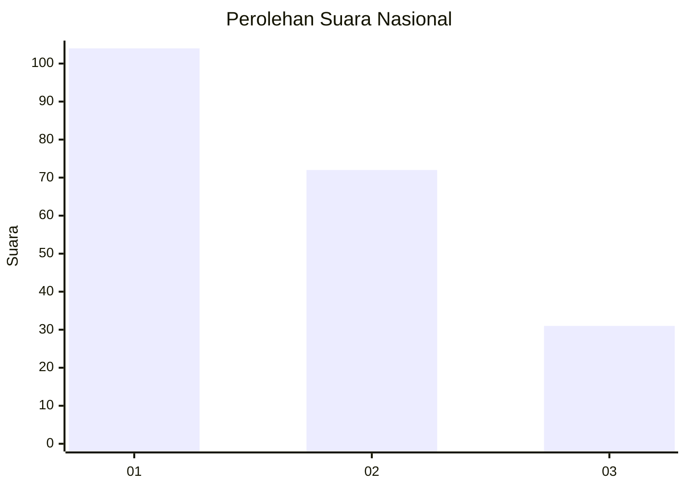
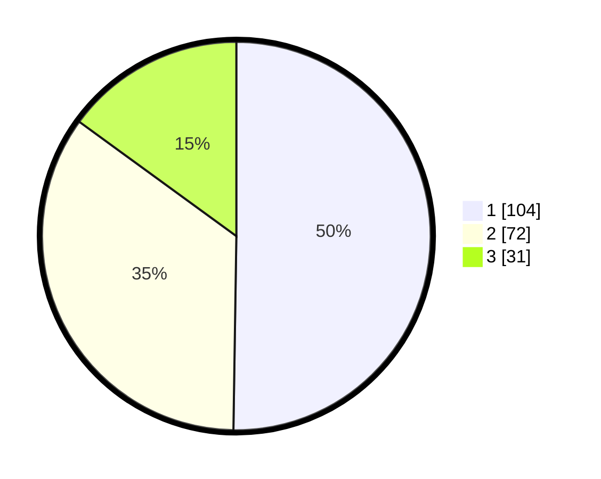

# Hasil

## Grafik

## Tabel

| No. | Nama Paslon    | Suara | Suara (raw) | Persentase |
|:--- |:-------------- | -----:| -----------:| ----------:|
| 1   | ANIES MUHAIMIN | 104   | [104][p-1]  | 50,24      |
| 2   | PRABOWO GIBRAN | 72    | [72][p-2]   | 34,78      |
| 3   | GANJAR MAHFUD  | 31    | [31][p-3]   | 14,98      |

[p-1]: https://github.com/gigit-pemilu/pemilu-2024/blob/main/pilpres/hitung-suara/sub/19-kepulauan-bangka-belitung/sub/71-kota-pangkal-pinang/sub/06-gabek/sub/1001-selindung/sub/017-tps/sub/paslon-1.txt
[p-2]: https://github.com/gigit-pemilu/pemilu-2024/blob/main/pilpres/hitung-suara/sub/19-kepulauan-bangka-belitung/sub/71-kota-pangkal-pinang/sub/06-gabek/sub/1001-selindung/sub/017-tps/sub/paslon-2.txt
[p-3]: https://github.com/gigit-pemilu/pemilu-2024/blob/main/pilpres/hitung-suara/sub/19-kepulauan-bangka-belitung/sub/71-kota-pangkal-pinang/sub/06-gabek/sub/1001-selindung/sub/017-tps/sub/paslon-3.txt

## Foto C Plano

https://sirekap-obj-formc.kpu.go.id/3999/pemilu/ppwp/19/71/06/10/01/1971061001017-20240214-234633--0afd4dbf-48e8-4f9e-8385-993b9a45fb27.jpg

https://sirekap-obj-formc.kpu.go.id/3999/pemilu/ppwp/19/71/06/10/01/1971061001017-20240214-234757--7d771a57-2d3a-4fd5-a9fc-2f014e11879d.jpg

https://sirekap-obj-formc.kpu.go.id/3999/pemilu/ppwp/19/71/06/10/01/1971061001017-20240214-234906--fa86fb85-1d99-487f-9cef-bfaad39bc07b.jpg

## Metadata

| Key        | Value               |
| ---------- | ------------------- |
| Time Stamp | 2024-02-15 23:29:50 |

